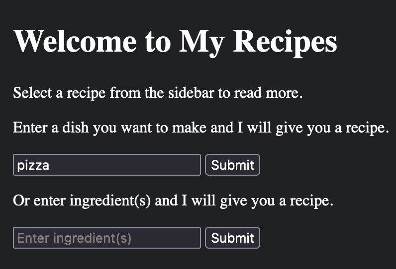
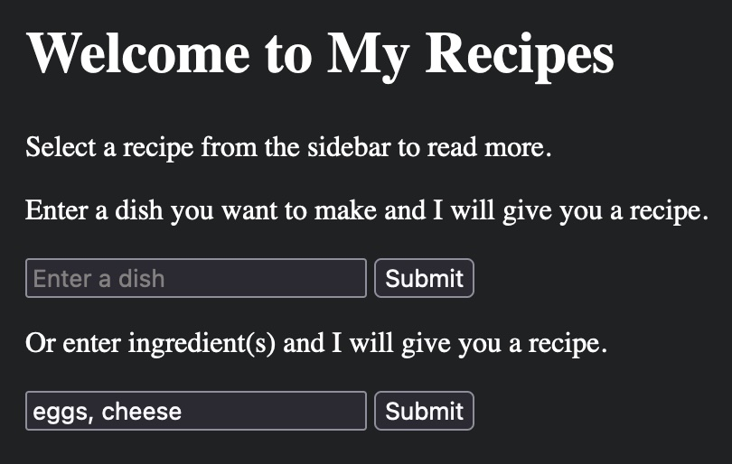

# Recipes by GPT

# Summary

- This is a simple Flask app that uses the ollama API to generate recipes.
- The app takes a user's input, uses the llama 3.2 model to generate a recipe, and displays the recipe on a webpage. The recipe is composed of ingredients, instructions, and tips.
- The recipe is added to the list of recipes on the homepage's sidebar. 

# How to Run

1. Install the required packages: `pip install -r requirements.txt`
2. Start ollama, and run the llama 3.2 model
2. Run the app: `flask run`
3. Go to `localhost:5000` in your web browser to see the app.

# Usage
## Searching By Dish
Generate a recipe for a specific dish by entering the name of the dish in the text entry bar.

## Searching By List of Ingredients
Generate a recipe based on a list of ingredients by entering a comma separated list of ingredients in the text entry bar

